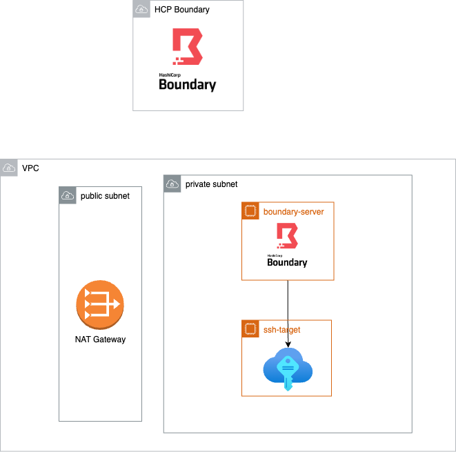

# Boundary sandbox

Minimal setup for testing out HCP Boundary multi-hop feature with SSH credentials injection


## Pre-req
- Terraform
- AWS account with CLI access
    - configure AWS profile locally
- running [HCP Boundary cluster](https://portal.cloud.hashicorp.com/services/boundary/)
## Provisioning 

Provisioning AWS resources for the sandbox

1. VPC with private and public subnet
2. EC2 instance for running `boundary-worker` inside the private subnet
3. EC2 instance acting as a private ssh target

This way, both `boundary-worker` and `SSH target` are not reachable from the public internet (no public IP)



### Create TFVARS

Create tfvars file to hold sensitive information

```bash
# dev.tfvars
hcp_boundary_auth_method = "<HCP boundary auth method ID>"
hcp_boundary_username    = "<username>"
hcp_boundary_password    = "<password>"
hcp_boundary_cluster_id  = "<cluster>"

aws_profile = "<aws-profile-name>"
aws_region = "us-west-2"
availability_zones = ["us-west-2a", "us-west-2b"]
```

### Provision resource

- run `terraform init`


```bash
terraform plan -var-file=envs/dev.tfvars
terraform apply -var-file=envs/dev.tfvars
# Follow the prompt
```


## Connect

Install [Boundary client](https://developer.hashicorp.com/boundary/tutorials/oss-getting-started/oss-getting-started-desktop-app)

Login to your Boundary cluster in the client

Select "my first ssh target" and click `Connect`

run `ssh localhost -p <output-port>`
